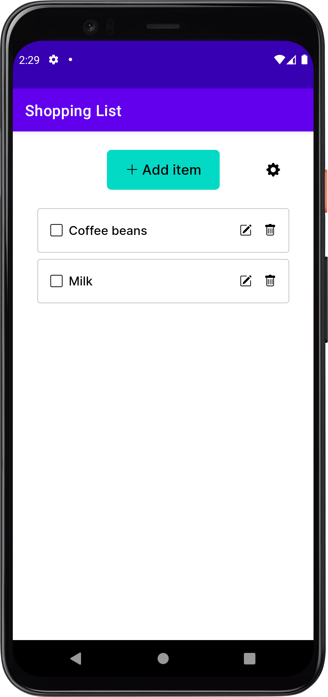
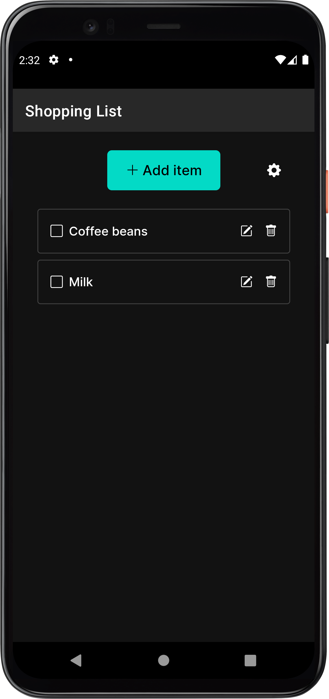

# Shopping List Android

[](https://github.com/hidakatsuya/shopping_list-android/actions/workflows/test.yml)

An Android client for the [Shopping List](https://github.com/hidakatsuya/shopping_list) web
built with [turbo-android](https://github.com/hotwired/turbo-android).

<div>
  
  
</div>

## Built With

- [Turbo Native for Android](https://github.com/hotwired/turbo-android) 7.0.0-rc14

## Getting Started

These instructions will get you a copy of the project up and running on your local machine for development and testing purposes.

### Prerequisites

- [Shopping List web application](https://github.com/hidakatsuya/shopping_list)
- [Google Sign-in for Android](https://developers.google.com/identity/sign-in/android/start)
- Google Client Id

### Installing

Set the following configs to create `debug.properties` file:
```
BASE_URL=<base url for the development version of your Shopping List app, usually this would be http://localhost:3000>
GOOGLE_CLIENT_ID=<your client id>
```

Build and run app.

## Deployment

1. Set the following configs to create `release.properties` file
  ```
  BASE_URL=<base url for the production version of your Shopping List app>
  GOOGLE_CLIENT_ID=<your client id>
  ```
2. Set up [App signing](https://developer.android.com/studio/publish/app-signing)
3. Create `app/signingConfigs/release.gradle` and move `signingConfigs` added to `build.gradle`
4. Build app

## License

This project is licensed under the MIT License - see the [LICENSE](LICENSE) file for details
